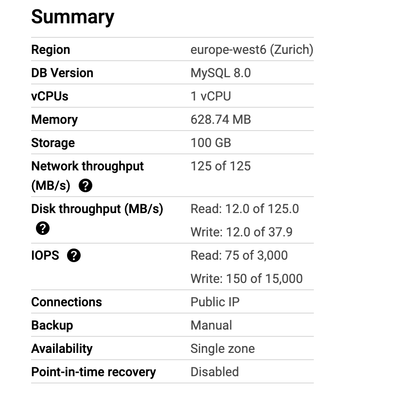
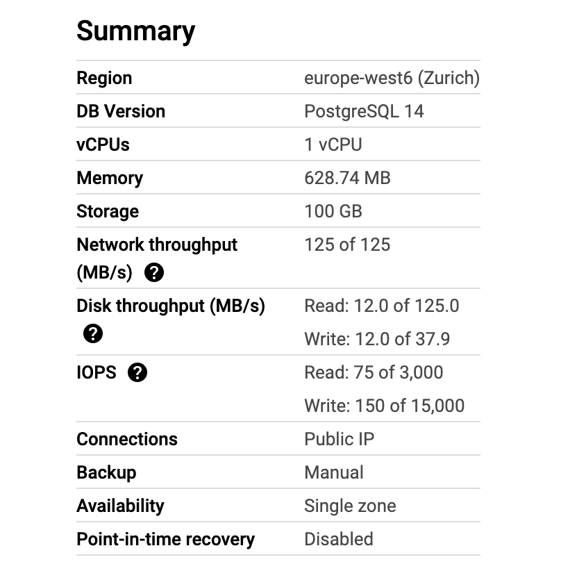

# Google Developer Groups Zurich Talk 2023

**Slides**: You can look in the repo for slides.pdf

**Pre-recorded video for who missed the talk**: https://www.youtube.com/watch?v=AxQnLxw7tvM

**Title Talk**: Beyond the Surface: Why You Need to Understand Database Structures for Optimal Performance

**Abstract Talk**:Are you tired of sluggish database performance and the limitations of sharding? Do you want to take your production database systems to the  next level? Look no further! In this talk, I will explore some  game-changing concepts that can improve your database's performance  without having to resort to sharding.

I'll start by diving into the world of B-Trees and B+Trees. By understanding the algorithms  behind these structures, you can unlock the full potential of your  database and boost scalability.

But that's not all - we'll also explore the importance of selecting the right ID for your B-Tree  based database engines. Did you know that using UUID could be killing  your database's performance? I'll explain why and provide  recommendations to help you optimize your system. I'll show you some  common mistakes people make and how to avoid them.

So if  you're ready to take your production database systems to the next level, join us as I explore these exciting topics on Google Cloud and unlock  the full potential of your database!

**Event Name**: Google Developer Group - Zürich 2023

**Location**: Google Office - 24 Europaallee Zürich, Zürich, 8004

Link to the event: https://gdg.community.dev/events/details/google-gdg-cloud-zurich-presents-gdg-cloud-zurich-meetup-6-april/

**Speaker**: Armando Ferrara

**Date**: Thu, Apr 27, 5:30 PM (CEST)

Contained within this repository are the presentation slides that were utilized during my talk, as well as data that can be reproduced through the use of Apache JMeter. It is recommended that interested parties utilize either the **mysql-plan.jmx** or **postgres-plan.jmx** file, with the query inside modified to align with their preference for UUIDv4 or ULID/UUIDv7.

It should be noted that the benchmarks featured in this repository were conducted on the following instance.

